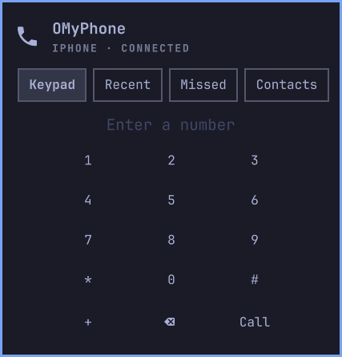

# OMyPhone

**Make and take phone calls from your Omarchy desktop, with your phone still in your pocket.**

OMyPhone turns your PC into a Bluetooth hands-free kit for your phone, the same way a
car does. Calls go over your phone's own number and plan. There is no app on the phone,
no VoIP account and no cloud: your call never leaves your desk and your phone.

<p align="center">
  
  &nbsp;&nbsp;
  
</p>

## Features

- **Dial from the bar.** Click the phone icon, type a number with the keypad or your
  keyboard, and press Call (or Enter).
- **Answer from the desktop.** An incoming call shows a card in the notification corner
  with **Answer** and **Decline**. It goes away by itself if you pick up on the phone.
- **In-call controls.** Hang up, mute your mic, and a keypad for menus ("press 1 for...").
  The bar shows the call timer.
- **Recent and missed calls.** Click one to call back. A missed call also sends a
  notification: click it to jump straight to the Missed tab.
- **Contacts and caller names.** Sync your phone's contacts once, then see who is
  calling on the call card, in Recent and Missed, and in missed-call notifications.
  Search the Contacts tab by name and click to call. Recent shows your phone's own
  call history, including calls made on the phone.
- **Stays connected.** If your phone drops off Bluetooth, OMyPhone reconnects to it on its
  own.
- **Your headset, your speakers.** Call audio uses your default mic and speakers, so a
  USB or Bluetooth headset just works.

## Requirements

- [Omarchy](https://omarchy.org) 4.0 or newer. It already has everything OMyPhone needs
  (PipeWire 1.4+, WirePlumber, BlueZ, Python with PyGObject). `bluez-obex` is only
  needed for contacts; OMyPhone offers to install it.
- A phone that works with a car kit (Bluetooth Hands-Free Profile). That is nearly every
  phone. Tested with an iPhone 13.
- Bluetooth on your PC.

## Install

```sh
omarchy plugin add https://github.com/boyidzham/omyphone --enable
```

Then pair your phone once, if you have not already: open Omarchy's Bluetooth panel,
pair the phone and allow it on the phone. OMyPhone finds the paired phone by itself and
the phone icon lights up in the bar.

To remove it: `omarchy plugin remove omyphone`.

## Settings

Both settings are optional. Set one with `omarchy bar set`:

```sh
omarchy bar set omyphone callScreen DP-1
```

| Setting | What it does |
|---|---|
| `phoneAddress` | The Bluetooth address of the phone to use, for example `AA:BB:CC:DD:EE:FF`. Only needed if you have more than one phone paired. Empty means "the first paired phone". |
| `callScreen` | The monitor for the incoming call card, for example `DP-1` (see `hyprctl monitors`). Empty means "the monitor you are using". |

## Contacts

Contacts are optional and stay off until you turn them on:

1. Open the popup, go to **Contacts** and press **Sync contacts**.
2. If the `bluez-obex` package is missing, a terminal opens to install it and asks for
   your password.
3. Allow sharing on the phone. iPhone: Settings > Bluetooth > (i) next to this PC >
   **Sync Contacts** (the switch appears after the first sync attempt). Android phones
   usually ask with a popup.

OMyPhone then syncs by itself every time the phone connects. Names, numbers and call
history (no photos) are kept only on your PC, in `~/.local/state/omyphone/`, readable
only by you.

## Tips

- **The icon is dimmed:** the phone is not connected. Check that Bluetooth is on on both
  sides. OMyPhone keeps trying to reconnect every 30 seconds.
- **Numpad keys do nothing:** turn on Num Lock. Without it the numpad sends arrow keys.
- **Recent calls** come from your phone once contacts are synced. Without that, they
  are the calls made through OMyPhone, stored only on your PC in
  `~/.local/state/omyphone/recents.json` (the last 100 calls).

## How it works

```
phone ── Bluetooth hands-free ──► BlueZ ──► PipeWire (org.pipewire.Telephony)
       │                                            │ D-Bus
       │                          OMyPhone helper (Python)
       │                                            │ JSON lines
       │                          Omarchy shell: bar icon, popup, call card
       │
       └─ Bluetooth PBAP (contacts) ──► BlueZ obexd (org.bluez.obex) ──► OMyPhone helper
```

PipeWire's Bluetooth support exposes the phone's call controls on D-Bus. A small Python
helper inside the plugin talks to it and to BlueZ, keeps your recent calls, and handles
mute and notifications. The bar widget only shows what the helper reports. The design
notes are in [`docs/`](docs/).

## Development

```sh
tests/run.sh          # all tests, on a private D-Bus bus with fake services; no phone needed
scripts/dev-sync.sh   # copy your working tree into the installed plugin and restart the shell
```

See [`CLAUDE.md`](CLAUDE.md) for the project layout and rules.

## Licence

[MIT](LICENSE) © 2026 Boyidzham
